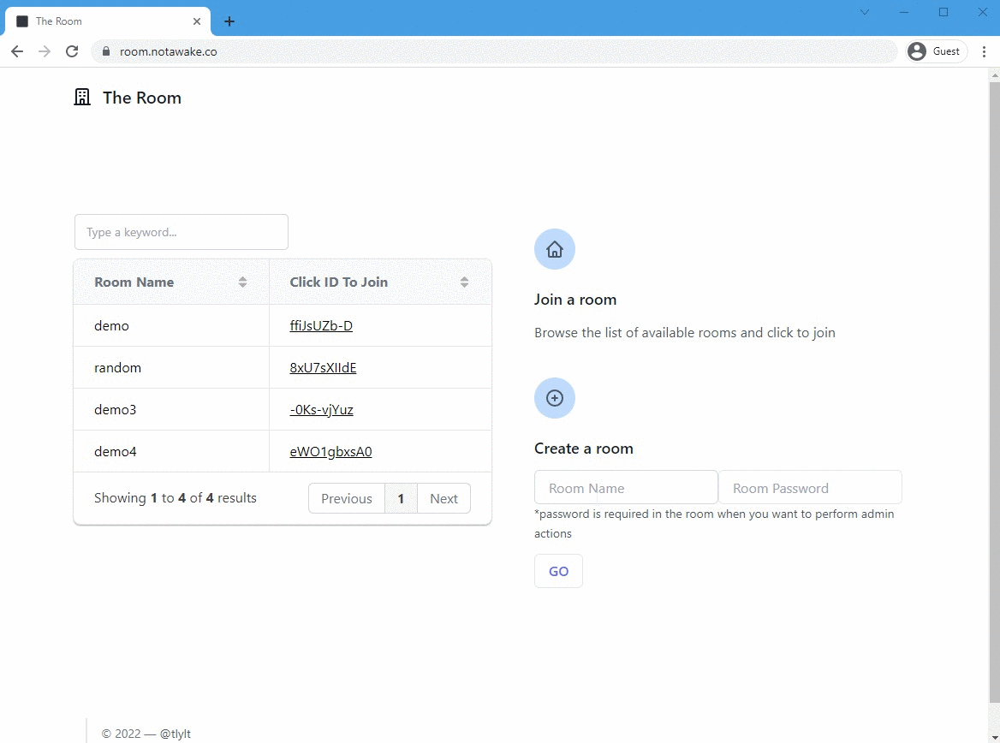
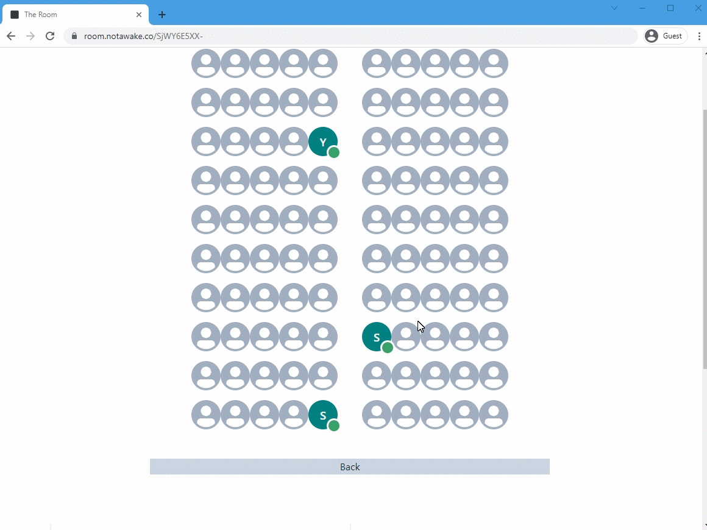
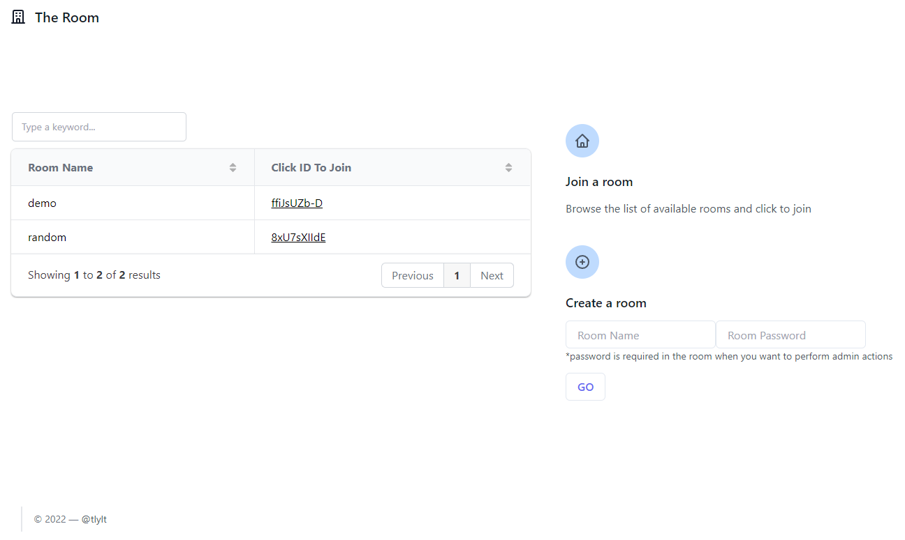
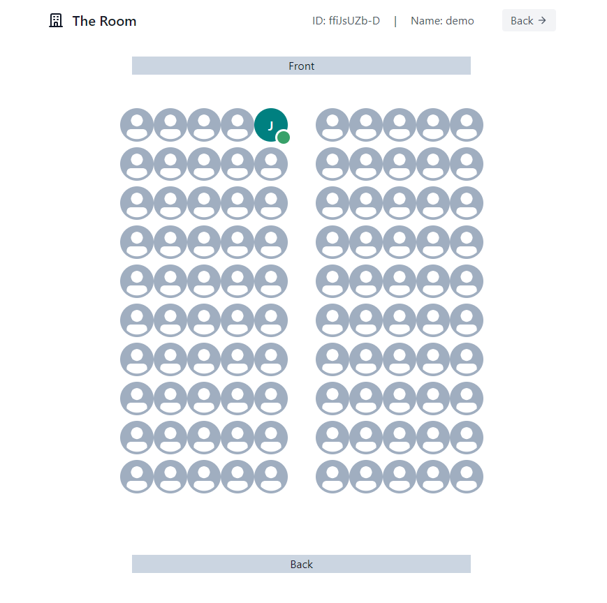
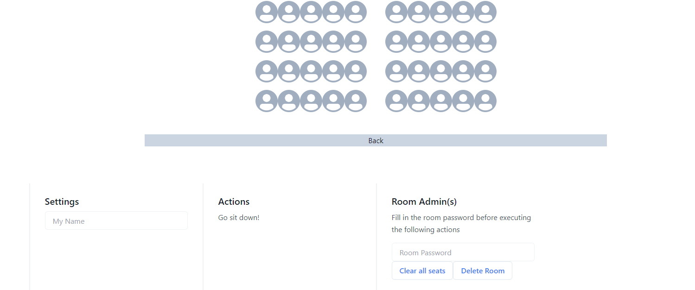

## Overview
When teaching a class of over 20 students, it may not be easy to learn their names immediately. Given that we do not always have access to a reference sheet with the student's name and their photo, an alternative is to have a reference of the student's name and where they are in the classroom. This project does just that!

## Functionalities
- Anyone can easily create a room with a room name and a password (to identify the room admin)
- Anyone can easily join a room with the room link or from the list of rooms in the home page
- Anyone can easily leave a room (just close the browser)
- In a room, one can choose to "sit" at a spot that mirrors his/her actual location in the classroom
- In a room, one can choose to "leave" the previous spot to switch to another spot
- The room admins can remove everyone from all the seats
- The room admins can remove a room

## Future Improvements
- The room layout should be configurable
- One can "raise hand" to seek attention from the room admin
- etc

## Demo

## Screenshots

  

  

  

## Tech Stack & Packages
- [Next](https://nextjs.org/)
- [MongoDB](https://www.mongodb.com/)
- [TailwindCSS](https://tailwindcss.com/)
- [Chakra](https://chakra-ui.com/)
- [swr](https://swr.now.sh/)
- [Gridjs](https://gridjs.io/)

## License
[APACHE LICENSE, VERSION 2.0](./LICENSE)
